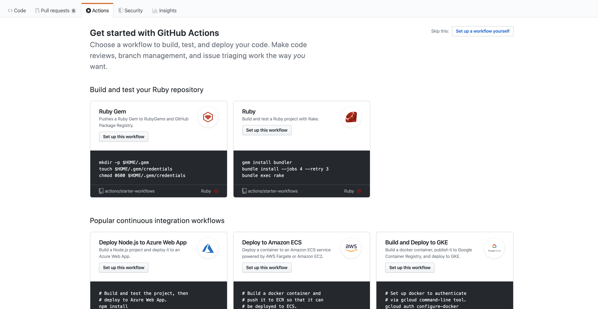

Webに関わる開発をしている方であれば、ソースコードのホスティングに[GitHub](https://github.co.jp)を利用している人は多いのではないでしょうか。

GitHubには[GitHub Pages](https://pages.github.com/)という機能があり、静的ページをホスティングすることができます。デフォルトでは`(GitHubのアカウント名).github.io` のリポジトリ名がURLとなりますが、カスタムドメインを使用することもできます。（個人的にgithub.ioは充分シンプルで良いと思うので、このまま使っています。）



また、昨年末にはCI/CDの機能を実現する[GitHub Actions](https://github.co.jp/features/actions)が正式版として公開され話題になりましたね。

> CI（Continuous Integration、継続的インテグレーション）はソフトウェアのビルドやテストを自動化して頻繁に実行することでソフトウェアの品質向上や開発効率化を目指す手法で、CD（Continuous Delivery、継続的デリバリー）はCIに加えてリリースやデプロイまでも自動化する手法。

CI/CDツールとしては[CircleCI](https://circleci.com/ja/)がよく使われている印象ですが、基本的にはGitなどのバージョン管理ツールと組み合わせて使われるため、GitHubだけで完結できるGitHub Actionsのシェアも今後大きくなることが予想されます。

これらのGitHubの機能を使うことで、以下のワークフローが実現できます。
1. 静的サイトジェネレータ（Jekyll,Hugo,etc...)でWebサイトを作成
2. リモートリポジトリ（今回はsourceブランチ）にプッシュ、GitHub Actionsがプッシュを検知し、ビルドを行う
3. 無事ビルドが完了すると、masterブランチにデプロイ

静的サイトジェネレータはに関して、JekyllはGitHub Pagesの公式サイトでも推奨されており、一度触ってみましたが、
- プラグインの豊富さ、好みのプラグインがあるか
- 情報の豊富さ、新しい情報が多いかどうか
- ビルドにかかる時間

等の理由でHugoを選択しました。
普段の開発でエディタはVimを使っているので、エディタ上で且つMarkdownで入力ができるのはとても使い勝手が良いです。


## GitHub Actionsの設定

最初にGitHub Actionsを設定していきます。
GitHubで今回使用するリポジトリを作成し、リポジトリメニューの中からActionsを選択します。
言語によっては既にあるワークフローを使うこともできるみたいですね。



今回は右上にある `Set up a workflow yourself` を選択します。

すると左側にyamlファイルを記述するエディタが表示されます。Marketplaceには既に用意されているActionsがありますので、こちらを使ってもいいです。基本的に構文ミスはエディタが指摘してくれますが、その他の細かい部分は右側にあるDocumentationに従い設定を進めましょう。
今回はスター数の多かった[Hugo Setup](https://github.com/marketplace/actions/hugo-setup)を使うことにしました。

```yaml
name: github pages

on:
  push:
    branches:
      - source

jobs:
  build-deploy:
    runs-on: ubuntu-latest
    steps:
      - name: Checkout Source
        uses: actions/checkout@v2

      - name: Clone submodule
        run: git submodule update --init --recursive

      - name: Hugo Setup
        uses: peaceiris/actions-hugo@v2.4.8
        with:
          hugo-version: latest
          extended: true

      - name: Build Hugo
        run: hugo -v

      - name: Deploy
        uses: peaceiris/actions-gh-pages@v3.5.6
        with:
          deploy_key: ${{ secrets.ACTIONS_DEPLOY_KEY }}
          publish_dir: ./public
          publish_branch: master
```

手順は以下の通りです。

- ソースコードのチェックアウト
- サブモジュールであるテーマをクローン
- Hugoのセットアップ
- Hugoのビルド
- Hugoのデプロイ

`uses`ではリポジトリを指定しており、`run` では走らせるコマンドを指定しております。

設定が終わったら`Start Commit`を押下し、ブランチは既にプッシュするブランチとして指定している`source` を作成し、commitします。

設定ファイルに書いた `deploy_key` を発行し、リポジトリに登録する必要があります。
Deployの際に使っているリポジトリ（https://github.com/peaceiris/actions-gh-pages）のREADMEにわかりやすい手順が載っているので、こちらは割愛します。


## サイトの作成

サイトの作成にあたっては[HugoのQuick Start](https://gohugo.io/getting-started/quick-start/)を参考にしました。

```shell
$ brew install hugo
$ hugo new site mywebsite
$ cd mywebsite
$ git init
$ git switch -c source
```

[サイトのテーマ](https://themes.gohugo.io/)は[hermit](https://github.com/Track3/hermit)を選択しました。
シンプルながら色合いもシックで落ち着いていて、非常に気に入っています。

手順通りにこのテーマのリポジトリを[サブモジュール化](https://git-scm.com/book/ja/v2/Git-%E3%81%AE%E3%81%95%E3%81%BE%E3%81%96%E3%81%BE%E3%81%AA%E3%83%84%E3%83%BC%E3%83%AB-%E3%82%B5%E3%83%96%E3%83%A2%E3%82%B8%E3%83%A5%E3%83%BC%E3%83%AB)します。

```shell
$ git submodule add https://github.com/Track3/hermit.git themes/hermit
```

その後、`config.toml` でWebサイトの設定をしていきます。
設定にあたっては、各テーマのリポジトリに含まれるものを参考にしました。
Google Analyticsを使ったアクセス解析などもこちらで設定できます。


## ページの作成

以下のコマンドで新規のブログ記事を作成します。

```shell
$ hugo new posts/first_post.md
```

テンプレートファイルである`archetypes/default.md` を元に `content/posts/first_post.md` が生成されます。

サーバーの立ち上げには以下のコマンドを入力します。

```shell
$ hugo server -D
```

`-D` オプションを付けることで、`draft: true` （本番環境では表示しない）設定のページの含めてビルドしてくれます。
`localhost:1313` でブラウザからページが確認できます。ホットリロードであるためファイル変更後に保存すると、自動的に変更を検知してビルド・リロードすることでブラウザ上に変更が反映されます。便利ですね…


最後に `hugo` コマンドでサイトを生成し、デプロイまで進めましょう。
変更をリモートリポジトリにプッシュすることでGitHub Actionsのジョブが走ります。以上で完了です。

## 最後に

はてなブログやQiitaのようなサービスと比べると、テーマ選定等も含めて初期設定に少し時間はかかりますが、ポートフォリオサイトとしても使えるのでオススメです。

GitHub Actionsを使えばデプロイも自動化できますし、やはりなによりもGitHub上で完結しているのはとても楽だと感じました。

全て無料で触ることができますので、是非お試しください。
